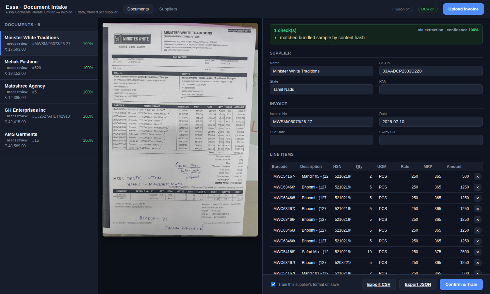
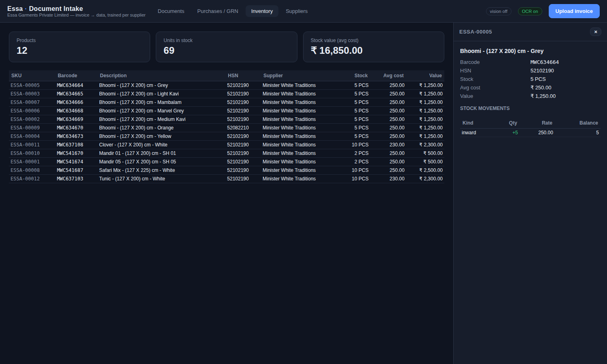

# Essa · Document Intake → Purchase / GRN → Inventory

Turn a supplier's purchase invoice (a phone photo, a scan, a PDF) into clean,
validated, structured data — **learn each supplier's format once** so the next
invoice from them is read automatically — then **post it as a GRN that updates
inventory** with proper stock movements and weighted-average costing.

Two modules, one pipeline:

1. **Document Intake** — image/PDF → canonical invoice, trained per supplier.
2. **Purchase / GRN + Inventory** — a confirmed invoice becomes a GRN; posting
   it matches or creates products, adds inward stock, and revalues at
   weighted-average cost. This is the intake output being *consumed*.

Together they replace the manual keying of supplier bills that today feeds
Invoice Entry, Inventory Entry and Stock Inward in the reference application.

**Modules built so far** (tabs across the top):

- **Documents** — intake: image/PDF → canonical invoice, trained per supplier.
- **LR Entry** — the transport register. Photograph a register page and vision
  reads every row, or press **New entry** and key one consignment in on a form
  that carries the Transport Entry field set Essa actually uses (mode, agent and
  commission, purchase manager, auto-transfer, stock holding period, additional
  margin, bundles/boxes/pieces, goods value, freight, item, attachments).
  **Search** filters the register and totals what it finds. Rows cross-link to
  their invoice automatically.
- **Purchases / GRN** — confirmed invoice → GRN → inventory (weighted-avg cost).
- **Inventory** — stock master with per-product **edit** and **stock
  adjustment** (physical-count correction), plus a movement ledger.
- **Stock Outward** — dispatch stock to a store/customer; posting reduces
  warehouse stock (guards against going negative). Every line shows the whole
  product record — **QR, name, size, colour, the rest of the attributes, and the
  batch (GRN / invoice / carton) it was received on** — and a garment can be
  scanned straight into the note, so the size that goes in the box is the size on
  the paperwork.
- **Stock Inward** — the receiving end of that dispatch. The destination scans
  each piece in, accepts line by line against the same document (same full
  product detail), and any shortfall is recorded as a transfer discrepancy
  instead of quietly disappearing.
- **Returns** — purchase return / **debit note** against a reference invoice:
  reverses stock and reduces the supplier's payable. Lines are the items that
  were actually *received* — a bundle broken down at GRN comes back as its
  variants — and each is priced at its **purchase / GRN cost, never the sale
  price or MRP**, so the debit reconciles against the supplier's own invoice.
  A second kind of line settles the same way and means the opposite: goods the
  supplier **billed and never delivered**, claimed straight from the shortages
  counted at the dock. Those come pre-filled and move no stock — the units never
  entered it. **Claim shortage →** on the invoice picker raises that note on its
  own.
- **Payments** — supplier accounts-payable: search pending bills, settle with
  cash + **discount + TDS + debit-note**, generates receipts and a ledger.
- **Reports** — 33 reports in the seven groups the reference app uses, each with a
  row filter, a date range where it makes sense, and CSV export that honours both:
  - *Transport* — Transport Report, Transport Pending Bills
  - *Invoice* — Invoice Report, Invoice Detail Report, WH Entry Report
  - *Stock* — Stock Report, **Stock as on Date** (replayed from the ledger),
    Stock Transactions, Stock Movement, Movement Locationwise, **Warehouse Stock
    Analysis**, **Stock Audit** (every physical-count correction)
  - *Purchase* — Purchase Report, Purchase Items, HSN, Tax, Tax Summary, Barcode
    wise, Section wise, Supplier Pending Bills, Supplier Payment, **GRN Shortage
    Register**
  - *Purchase Return* — Purchase Return Report, Section wise, **Return Audit**
    (which lines moved stock and which were shortage claims that never did)
  - *Outward* — Outward Report, Outward Details, Pending Inward, Pending Outward
  - *Other* — Product / Supplier / Agent / Tax masters

  Six reports in the reference catalogue are **deliberately absent** rather than
  present-and-empty, because this system records nothing to put in them: Stock
  Depreciation, Job Work Outward/Inward, Invoice vs Purchase Order, Retail Stock
  Analysis, and Purchase Return (Cancelled). Each needs a data model first — see
  [ARCHITECTURE.md](ARCHITECTURE.md) §9.

  **Ask a question instead of picking one.** The bar at the top of Reports takes a
  question in English or Tamil — *"what did we buy last month"*, *"நிலுவை பாக்கி
  எவ்வளவு"* — routes it to one of the 33 reports above and fills that report's
  filters. It does not generate SQL: each report already knows what it is counting
  and says so in its note, and a generated query would return a figure that
  disagrees with the same figure elsewhere in the app with no way to tell which is
  wrong. What it read is always shown above the table, including any filter the
  report could not honour (nothing filters by supplier, so that is narrowed after
  the fact and labelled as such). With no API key set it still works, matching on
  keywords instead of reading the sentence, and says which of the two answered.

  **🎤 or type.** The mic uses the browser's own recogniser — no audio leaves the
  machine and there is no extra key or cost — with an EN / தமிழ் switch, because it
  has to be told which language to expect. It needs a **secure context**, so it
  works at `http://localhost:8000` on the machine running the app but *not* over
  the LAN at `http://<computer-ip>:8000`; on that origin the button says so rather
  than failing silently. Typing works everywhere.
- **Suppliers** — suppliers and their learned formats.
- **Masters** — product categories, agents, transporters, and the dropdown lists
  the LR Entry form uses (purchase managers; plus the fixed LR mode, transfer
  location and attachment-type vocabularies).

There is also a **phone app** for the warehouse team, with the three jobs that
belong on the floor rather than at a desk, in the order the goods move:

- **Consignments** — take each arriving consignment in. The register is read off
  the page on the desktop, but only the person on the dock knows who actually took
  the packages, so **Received by** is recorded *here* and nowhere else: tap a
  pending consignment and it is stamped with your name. The desktop LR Entry shows
  it read-only.
- **Receive** — open a goods receipt and **break each billed bundle into the sizes
  that actually arrived**. The supplier bills "WOMEN'S T-SHIRT, 50 PCS" and never
  prints the mix; only the person opening the cartons knows it. Tap a size chip,
  type the quantity (or **rest** for the remaining balance), open a row for colour /
  material / pattern / fit / type / design no / category and per-size pricing.
  **Post to inventory** then creates **one product per size, each with its own SKU
  and QR code**, its own inward stock movement and its own weighted-average cost.
  The bundle line is marked **split** and never becomes stock itself. A breakdown
  that doesn't add up saves but refuses to post, so units can't be quietly lost or
  invented. Correcting a posted GRN is still a desk job (unpost checks payments,
  debit notes and dispatches first).

  And when the box is short, **say so** — see **Shortage entry** below. The
  breakdown then has to reach what *arrived*, not what was billed.

  Posting also gives every line a **carton label** (`ESSA-B-00001`) — printed there
  and then, because the goods are on the floor and have to go on a rack. See
  **Bundles** below.

  And it gives every *piece* its own code. A split row of 8 becomes **one inventory
  record** (`ESSA-00008`, qty 8) with **8 unique child QRs** beneath it —
  `ESSA-00008-001 … -008`, all linked to that one SKU. In **Inventory**, click the
  quantity to see all 8, each with **View / Print / Reprint**. Scanning any child
  code resolves to the product, so it works anywhere a SKU code does, while the
  code itself says *which* of the eight it is. Goods measured rather than counted
  (fabric by the metre) get no piece codes, and the screen says why.

  The receipt then becomes a **detailing worklist** — *"4 of 4 still to detail"*.
  Tap an item to record what the invoice couldn't say (fit, pattern, material, MRP,
  sale price) with its QR on screen to check against the label in your hand; saving
  ticks it over to **detailed** and fills out its QR payload. The code itself is
  issued at post and never changes, so nothing sits in stock unscannable — detailing
  enriches the existing code rather than minting a second one.
- **Bundles** — the cartons, and the **two labels** an item can carry. A **carton
  label** is printed the moment a GRN posts and answers *which box is this, what's
  in it, where does it live*: scan it, record the rack it went on, find it again,
  move it. Later, when the box is opened for packing or retail, detail its items
  and hit **Tag & print** — that is when the **individual garment tags** come out,
  one per item, carrying size, colour, category, SKU and MRP. Tagging is refused
  while any item is still undetailed, because the whole point of waiting is that by
  then the tag can carry what someone actually saw. A carton is a *handling* unit,
  never a stock row — the pieces inside are already counted as the items they
  became, so nothing is double-counted, and the two code types are distinct enough
  that scanning a box where a garment is expected fails loudly.
- **Products** — physically **detail each product** that arrived from an invoice:
  pick a product (search or barcode/QR scan), record Color / Size / Pattern / Fit /
  Type / Material / Design No / MRP / Sale price / Discount %, and save to the same
  database. Attributes already set on the GRN arrive pre-filled, so only what the
  invoice couldn't say needs typing. The desktop Inventory tab shows what was
  detailed and by whom.

Two ways to use it:

- **Phone web app (recommended — zero setup):** with the server running, open
  **`http://<your-computer-ip>:8000/m`** in the phone's browser (same WiFi), sign
  in, and go. Tap the browser's **Add to Home Screen** for an app icon. Nothing
  to install — it's served by the same backend.
- **Native app (optional):** a React Native / Expo project in `mobile-app/` for a
  true installable APK/IPA. See `mobile-app/README.md`. (The web app above is the
  easiest path if Expo Go gives you network trouble.)

The interface is built on the brand colour **#5A3428** over a warm light surface,
with one type scale, one spacing scale and one alignment rule (text left, figures
right and tabular) across every screen — desktop and phone. Every text/background
pair meets WCAG AA; see [ARCHITECTURE.md](ARCHITECTURE.md) §7f for the palette and
the reasoning.

**Every screen carries the same three controls**, so the module you learn first
teaches you all the others:

- **⌕ Search** filters what is already on screen (Esc clears it).
- **⛭ Filter** decides what is on screen at all — status chips with live counts
  for the common cases, a panel for category / supplier / date range. It always
  shows how many filters are active and clears them in one click, so a shortened
  list is never mistaken for missing stock.
- **− Minimize** collapses a panel, remembers it across reloads, and keeps saying
  what it holds while closed.

Every icon carries a tooltip, and the open tab is remembered too.

**Dates** are picked from a calendar everywhere — invoice review, LR Entry and its
register import, payments, returns, stock outward/inward, and the search filters —
and stored as ISO `YYYY-MM-DD`. A date read off a page in the page's own form
(`31/07/2026`, `31-7-26`, `31 Jul 2026`) is converted as it is saved; one the
parser can't read is **kept exactly as it arrived** and flagged on screen rather
than silently blanked. That consistency is what makes the LR date-range search and
the supplier-ageing figures correct — see [ARCHITECTURE.md](ARCHITECTURE.md) §7d.

The module behaviours were matched to the reference recordings — see
`docs/APP_ANALYSIS.md` for the per-screen field/flow notes that drove the build.
Still to come (optional): two-location stock transfer (store-side inward accept)
and barcode printing.




---

## Why this design

Every supplier bills on a **different layout** — Minister White is a barcoded
GRN with CGST+SGST, AMS Garments is a readymade-garment invoice with IGST,
GH Enterprises carries a handwritten TDS, Matoshree is a Tally toy invoice at
18% IGST, Mehak is a fabric bill priced per metre. A single rigid template
cannot read all of them, and drawing fixed boxes on a page breaks the moment a
supplier shifts their layout.

So the engine is built on two ideas:

1. **Pluggable extraction providers.** Whatever reads the page — a vision model
   (best for messy real scans), offline Tesseract OCR (no API key, works
   offline), or the bundled verified samples — returns the *same canonical
   invoice shape*. Providers are swappable without touching the API, database
   or UI.

2. **Train once per supplier.** The first time a supplier's invoice arrives you
   correct the draft and hit **Confirm & Train**. The system saves that
   supplier's *profile*: how to detect them (GSTIN), their tax behaviour
   (intra-state CGST+SGST vs inter-state IGST, whether TDS applies), default
   unit of measure, and a confirmed example used to guide future reads. Next
   time, the supplier is auto-detected and extracted with that profile.

A **reconciliation layer** then checks every invoice against its own arithmetic
— line `qty × rate = amount`, `Σ qty = total qty`, `taxable × rate = tax`,
`taxable + tax + charges = grand total` — and flags any field that doesn't add
up for human review, with an honest confidence score. These are the invoice's
own internal identities, so a single misread digit is caught without any
ground-truth to compare against.

---

## Quick start

Requirements: Python 3.10+, Node 18+. Tesseract is optional (only for the
offline OCR path — if you turn on Vision you don't need it).

### macOS / Linux

Tesseract via `brew install tesseract` or `apt install tesseract-ocr`.

```bash
./setup.sh      # installs backend deps, builds the frontend  (one time)
./run.sh        # seeds the DB on first run, serves everything on :8000
```

### Windows

Install [Python](https://www.python.org/downloads/) (tick "Add to PATH") and
[Node.js](https://nodejs.org/). Then double-click (or run in a terminal):

```bat
setup.bat       :: installs backend deps, builds the frontend  (one time)
run.bat         :: seeds the DB on first run, serves everything on :8000
```

Tesseract on Windows is optional. If you want the offline OCR path, install it
from the [UB Mannheim build](https://github.com/UB-Mannheim/tesseract/wiki),
then either add it to PATH or set an environment variable before `run.bat`:

```bat
set ESSA_TESSERACT_CMD=C:\Program Files\Tesseract-OCR\tesseract.exe
```

If you only use Vision (recommended), you can skip Tesseract entirely — the app
runs fine without it. PDF uploads additionally need
[poppler](https://github.com/oschwartz10612/poppler-windows) on PATH; image
uploads (JP/PNG) need nothing extra.

Open **http://localhost:8000**. You'll get an animated login screen — sign in
with the default credentials:

```
username: admin
password: essa@123
```

Change them via environment variables before `./run.sh`:
`ESSA_USER`, `ESSA_PASSWORD` (and `ESSA_AUTH_SECRET` for the token salt). The
login gates the UI for a local single-user deployment; hardening every API
endpoint with token auth is a documented next step for networked use.

After signing in, the app opens pre-loaded with the five sample suppliers and
their invoices. Every list screen has a **search box** to filter it, and Reports
has a row filter. Use **Logout** (top-right) to sign out.

### Turn on Vision extraction (recommended for real uploads)

The bundled samples always extract perfectly (they're pre-verified). For
**genuinely new** uploads, turn on the vision model — otherwise new uploads fall
back to offline OCR and come back low-confidence for review.

Easiest way: click the **👁 vision** pill in the top-right of the app, paste your
Anthropic API key, and hit **Activate vision**. The key is validated live
against Anthropic, stored locally in `data/settings.json` (git-ignored), never
displayed, and takes effect immediately — no restart. New uploads now go through
the vision model.

Prefer an environment variable instead? `export ANTHROPIC_API_KEY=sk-...` before
`./run.sh` works too. Either way the app runs fine with no key at all.

### Development mode (hot-reload UI)

```bash
# terminal 1 — backend
cd backend && . .venv/bin/activate && uvicorn app.main:app --reload
# terminal 2 — frontend dev server (proxies /api to :8000)
cd frontend && npm run dev      # http://localhost:5173
```

---

## The workflow

1. **Upload** an invoice (or use a pre-loaded sample). The engine OCRs the
   header, detects the supplier by GSTIN, loads their trained profile if one
   exists, and extracts the whole invoice.
2. **Review** side-by-side: the original image on the left, editable fields and
   line items on the right. Anything that failed a check is highlighted; the
   warning box lists exactly what didn't reconcile.
3. **Confirm & Train.** Fix anything wrong and save. With *Train* on, the
   supplier's format is learned (or its profile version bumped). The
   **Suppliers** tab shows each supplier's trained/untrained state and the
   learned profile.
4. **Export** the confirmed invoice as purchase-entry JSON or a line-item CSV
   for the ERP purchase/GRN module.

---

## Purchase / GRN + Inventory

Once a document is confirmed, click **Create GRN** on the review screen. That
builds a draft GRN and matches every line against the inventory master —
**matched** (an existing product, by barcode, or by description + HSN + supplier
for un-barcoded suppliers) or **new**. Review the draft in the **Purchases /
GRN** tab, then **Post GRN to Inventory**:

- new products are created (auto-assigned an `ESSA-#####` SKU),
- one **inward stock movement** is appended per line,
- each product's `stock_qty` and **weighted-average cost** are updated
  (`new_avg = (old_qty·old_avg + in_qty·in_rate) / (old_qty + in_qty)`),
- the document is marked `posted`. Posting is **idempotent** — a GRN posts once.

The **Inventory** tab shows every product with live stock, average cost and
valuation, plus a per-product movement ledger with running balances. Re-buying
the same barcoded item later matches the existing product and re-averages its
cost rather than creating a duplicate.

**Inventory is a view, not an entry form.** A product is whatever its GRN made it:
description / HSN / UOM come off the invoice, category and prices are set on the
**GRN breakdown**, and the physical attributes (size, colour, material, pattern,
fit, type, design no) are recorded in the **phone app** by whoever is holding the
product. So the product panel shows all of it read-only — including who last
detailed it — and there is no edit form and no edit endpoint. Correcting a product
means **↺ Unpost** the GRN, fix the line, post again. That's deliberate: an edit
here could leave the master data disagreeing with the document and the stock ledger
that produced it.

What Inventory does own is what belongs to stock rather than to the product: the
**stock adjustment** (a physical-count correction, written as a movement — never a
silent overwrite), identifier generation, label printing and the movement ledger.

### Labels that scan

A garment tag carries a **32mm** QR (cartons get 40mm) with the four-module quiet
zone the QR standard requires, a text column it never shares, and every row
clipped so a long colour or material can't run into the code. Print at **100% /
"Actual size"** — scaling shrinks the modules and the margin with them.

Sizes were chosen against the worst realistic payload rather than the average one:
a long supplier description with every attribute filled still gets 0.52mm per
module, against the ~0.33mm a phone camera needs in warehouse light. The QR
payload is unchanged, so tags already printed keep working.

Printing is guarded — see **Inventory integrity** below.

### Inventory integrity — what counts as stock

Stock is only ever created by posting a GRN, so a record that traces back to no
posted GRN is not stock. Those are hidden from Inventory, left out of the unit
count and the valuation, refused piece codes, and blocked from printing labels;
the excluded count is reported on the summary so nothing goes missing quietly.

Labels are refused when the piece codes and the stock figure disagree, or when
stock is zero — you cannot tag garments you do not have, and a stale code prints a
real-looking QR that scans like any other. Reprinting a single torn tag still
works, because that is exactly the job someone does while a count is being sorted
out.

**Inventory Repair** (a panel that appears on the Inventory tab only when
something is wrong) finds orphan products, orphan piece codes and orphan cartons,
shows them, and deletes them on confirmation. It never removes a product kept at
zero stock after an unpost — that one holds detailing the warehouse recorded by
hand.

### Correcting a posted GRN — Unpost

Posting is where a GRN becomes financial record, so a posted GRN can't be edited
in place. To correct one, press **↺ Unpost** on it: the stock it added is reversed,
each affected product's quantity and weighted-average cost are **replayed from the
remaining ledger** (a weighted average can't be un-mixed arithmetically — it
depends on the order things arrived), and the GRN returns to `draft` where lines,
breakdown and category are editable again. Then post it a second time.

What happens to the products depends on where they came from:

- **Products that existed before** keep their history — a compensating `reversal`
  row is appended and nothing is erased.
- **Products this GRN created**, that nothing else has touched, are removed with
  their rows. For those "as if never posted" is the honest outcome and leaves no
  zero-stock ghosts. Anything with its own history — phone-recorded details,
  another GRN, a dispatch, a return — is kept instead, at zero stock.

Unpost is **refused**, with the reason, when something already depends on the GRN:
a payment settled against the invoice, a debit note raised against it, or stock
that has since been dispatched (the balance would go negative — it says which
product and by how much). Clear that first. `GET /api/purchases/{id}/unpost-check`
returns the same list, so the UI can warn before you commit.

A GRN built from the wrong invoice, or a duplicate, is better deleted than
corrected: unpost it, then **Delete GRN**. The invoice document is left alone, so
you can build a fresh GRN from it — or delete the document too.

### Shortage entry — when the box is short

A supplier bills 50 pieces and 40 come out of the cartons. Until this existed the
receiving screen had two answers and both were lies: **invent** ten pieces so the
breakdown balances — inventory then carries phantom stock for ever, priced,
scannable and undispatchable — or leave the receipt **unpostable** and the goods
unbooked. Shortage entry is the third answer, and it is the true one.

It belongs to the **Receive flow**, before *Post to inventory*, and nowhere else.
The person opening the cartons is the only one who can know what was in them, and
the moment the GRN posts the difference becomes invisible: stock says 40, the
invoice says 50, and nothing on the system remembers that the two ever disagreed.
So it is recorded on the phone, at the dock — **⚠ Something missing or damaged?**
on the line, or one tap on *“10 not in the box? record as shortage →”* the moment
the sizes fail to add up, with the quantity already filled in. The same editor is
on the desktop GRN under **Shortage**, for whoever is at a desk instead.

Three kinds, and the only thing separating them is which side of the count they
land on:

| | what happened | stock | supplier |
|---|---|---|---|
| **Short** | billed, never arrived | never received | claimable |
| **Damaged** | arrived unusable, rejected at the dock | never received | claimable |
| **Excess** | more arrived than was billed | received | ours, no claim |

So one number changes, everywhere:

```
received = billed − short − damaged + excess
```

`received` is what the **attribute breakdown has to add up to**, what posting turns
into stock, what goes in the carton and what gets a piece code. `billed` is left
exactly as the supplier wrote it — the same reason a breakdown never rewrites its
line — so invoice arithmetic and the payables side keep reconciling against their
own document. A line billed and *not delivered at all* creates no product, no
stock and no carton label: there is no box to put a label on.

Nothing about the money is stored on the shortage. It is a fact about a **count**;
what it is worth is a fact about the GRN, derived from the line rate — the same
basis a debit note is valued at, because a claim against a supplier can only carry
what that supplier charged. Posting freezes the shortages along with everything
else: correcting one means **↺ Unpost**, fix, post again.

Then the claim writes itself. **Returns → Claim shortage** builds a debit note
whose lines are already filled in at the counted quantity, because that part was
settled when the boxes were opened — nobody counts twice. Those lines reduce the
payable at the GRN rate and **move no stock**, since the units they debit never
entered it. A shortage nobody intends to chase is **waived** instead (the supplier
is re-sending, or it isn't worth the paperwork) and stays on the record either way;
one already answered by a posted debit note reads `claimed` and cannot be claimed
again. The **GRN Shortage Register** report lists the lot, with the unclaimed
value separated out.

### Breaking a bundle line down by attributes

Suppliers bill a bundle — *WOMEN T-SHIRT, 250 PCS* — and never print the mix, but
the goods arrive as distinct items and stock has to carry each separately. So the
GRN line is broken down **before** anything reaches inventory. On a draft GRN,
click **Break down** on the line and enter what actually arrived, one row per
item, across:

| Identity (what makes it a distinct product) | Classification | Price (per row) |
|---|---|---|
| Size · Colour · Material · Pattern · Fit · Type · Design No | Category | Qty · Rate · MRP · Sale price · Discount % |

**Category** is set on the GRN — on the line, or per breakdown row — so products are
created already mapped to the category master instead of arriving *unmapped* for
someone to fix one at a time in Inventory. The grid shows what the description
would map to (`use LADIES-T-SHIRT`, with a `?` when the guess isn't confident) so
accepting it is one click; a category chosen by hand always wins over
auto-classification, and a blank one still falls back to it. Breakdown rows
inherit the line's category, so the common case — one category, several sizes —
needs no repetition.

That mapping is what keeps **one** product master across every supplier. Suppliers
name the same garment differently — *Women's T-Shirt*, *Ladies Tee*, *Female
T-Shirt*, *Women's Tee* — and all of them classify to the single internal category
**LADIES-T-SHIRT**, so there is one record, one QR, one stock figure and one line in
every report instead of four near-duplicates. The engine is rule-based and offline
(no model call, no per-line cost, same answer every time), and it **learns**: the
moment someone sets a category by hand, that wording is remembered and maps itself
on the next invoice — shown as `use LADIES-T-SHIRT · learned`. One correction covers
every spelling that reduces to the same thing, so teaching it "Ladies Tee" also
teaches "Women's Tee" and "LADIES TEE 3PC". When a description matches nothing
confidently it is left for a human rather than filed somewhere plausible; see
[ARCHITECTURE.md](ARCHITECTURE.md) §7a for how confidence is decided and what the
rules were measured to cost.

Fill only the attributes that actually differ — 50 S / 50 M / 70 L needs the Size
column alone; a bundle mixing cotton and rayon in each size uses Size + Material.
**⧉ duplicate last** copies the previous row's attributes so you change just what
differs. The editor shows how much of the billed quantity is still unassigned, and
the GRN **cannot post** until the rows add up — otherwise stock would silently
gain or lose units.

Posting turns that one billed line into **one product per distinct combination**,
each with its own `ESSA-#####` SKU, which is the code its QR label carries (the
supplier never printed a code for "L / Red" on its own),
each with its own inward movement and weighted-average cost. From then on a single
variant can be priced, scanned, dispatched and returned on its own. The QR carries
the whole attribute record, so one phone scan returns everything about the item.

A variant's identity is its **whole attribute tuple**, compared exactly: buying
the same combination again merges into that product and re-averages its cost,
while any different combination is created fresh. Matching on only the filled-in
attributes would quietly fold *L* into *L / Red* for whichever arrived first.

The invoice line itself is left untouched: it stays the record of what the
supplier billed, so invoice arithmetic and the payables side still reconcile
against the original document. Attribute values come from the same option lists
the phone app uses, plus anything already in the database, so the office and the
warehouse share one vocabulary.

Where a variant already exists in inventory, scan its **QR code** (⌗ QR on the
row) to pin the row to that exact product instead of relying on the description
match; the same works on a line with no breakdown. A scanned QR, barcode or SKU
are all accepted.

## Adding a new input format

There is nothing to code. Upload one invoice from the new supplier, correct the
extracted draft, and Confirm & Train. From then on that supplier is recognised
by GSTIN and read with its profile. Retraining later simply creates a new
profile version — history is preserved.

---

## Project layout

```
essa-intake/
├─ backend/
│  ├─ app/
│  │  ├─ main.py            FastAPI app; serves the built UI too
│  │  ├─ models.py          Supplier · SupplierProfile · Document · Extraction
│  │  │                     · LineItem · Product · Purchase · PurchaseLine
│  │  │                     · PurchaseLineSplit (variant breakdown)
│  │  │                     · GrnShortage (billed but not received) · StockMovement
│  │  ├─ schemas.py         canonical invoice schema + API shapes
│  │  ├─ extraction/
│  │  │  ├─ base.py         provider interface + canonical shape
│  │  │  ├─ seeded.py       verified samples (hash-matched) — demo + fixtures
│  │  │  ├─ tesseract_ocr.py offline OCR provider
│  │  │  ├─ claude_vision.py vision-model provider (recommended)
│  │  │  ├─ validate.py     reconciliation + confidence + field flags
│  │  │  └─ engine.py       orchestrator: detect → extract → validate → learn
│  │  ├─ services/
│  │  │  ├─ inventory.py    GRN build + matching + stock posting/adjust (avg cost)
│  │  │  ├─ shortages.py    billed vs received — the gap, and the claim it becomes
│  │  │  ├─ outward.py      stock outward / inward (dispatch, then acceptance)
│  │  │  ├─ stock_view.py   one product record for every stock screen (QR + batch)
│  │  │  ├─ payments.py     accounts payable: pending bills, payments, ledger
│  │  │  ├─ returns.py      purchase return / debit note at GRN cost (+ payable)
│  │  │  └─ reports.py      report catalogue (stock, purchase, finance, masters)
│  │  ├─ routers/           documents · suppliers · purchases · inventory
│  │  │                     · outward · payments · returns · reports API
│  │  ├─ pos_mount.py       loads the retail shop (Flask) and mounts it at /pos
│  │  └─ seed.py            first-run seeding
│  └─ data/
│     ├─ ground_truth/      5 verified sample extractions (JSON)
│     ├─ sample_images/     the 5 sample invoices
│     └─ build_ground_truth.py  rebuilds + arithmetic-checks the fixtures
├─ frontend/                React + Vite review/training UI
└─ Textile Retail Shop/     the retail shop (Flask) — served at /pos
```

## POS — the retail shop

The **POS** button beside **Warehouse** in the nav bar opens the Taqua Silks
retail shop: billing counter, floor sales on a phone, invoices, shop stock,
customers, staff and shop reports. It is the Flask app in
`Textile Retail Shop/`, with its own SQLite database (`textile_shop.db`) and its
own login — sign in there the first time with `admin` / `admin123`.

It is not a second server. `backend/app/pos_mount.py` imports it and mounts it
as WSGI under this API at `/pos`, so both halves answer on one port. That is
what makes the frame work: on a second port the shop's login cookie would be a
third-party cookie inside the frame and the browser would throw it away.

Both codebases name their package `app`, so the shop is imported with ours
lifted out of `sys.modules` and put back afterwards. Its Python packages
(Flask and friends) are in `backend/requirements.txt`; without them the POS
screen says so instead of failing, and the rest of the app runs as before.

## Configuration

All via environment variables (see `.env.example`): `ANTHROPIC_API_KEY`,
`ESSA_EXTRACTION_PROVIDER` (`auto`|`claude_vision`|`tesseract`),
`ESSA_VISION_MODEL`, `ESSA_DATABASE_URL` (SQLite by default; point at Postgres
for production), `ESSA_COMPANY_GSTIN`, `ESSA_COMPANY_NAME`.

## API surface

| Method | Path | Purpose |
|---|---|---|
| POST | `/api/documents/upload` | upload → detect supplier → extract → draft |
| GET | `/api/documents` | list documents |
| GET | `/api/documents/{id}` | document + extraction + history |
| GET | `/api/documents/{id}/image` | original scan |
| POST | `/api/documents/{id}/confirm` | save correction, optionally train profile |
| GET | `/api/documents/{id}/export?format=json\|csv` | purchase-entry payload |
| GET | `/api/suppliers` · `/api/suppliers/{id}` | suppliers + learned profiles |
| POST | `/api/purchases/from-document/{id}` | build a draft GRN (matches inventory) |
| GET | `/api/purchases` · `/api/purchases/{id}` | list / view GRNs + matched lines |
| POST | `/api/purchases/{id}/post` | post GRN → create products, move stock |
| POST | `/api/purchases/{id}/unpost` | reverse a posted GRN back to draft (guarded) |
| GET | `/api/purchases/{id}/unpost-check` | what would block an unpost ([] = nothing) |
| DELETE | `/api/purchases/{id}` | delete a DRAFT GRN (document is kept) |
| PUT | `/api/purchases/lines/{id}/splits` | set (or clear) a line's attribute breakdown |
| PUT | `/api/purchases/lines/{id}/shortages` | what was billed and wasn't in the box (short / damaged / excess) |
| GET | `/api/purchases/{id}/shortages` | a GRN's shortages, what they're worth, what's been claimed |
| POST | `/api/purchases/shortages/{id}/waive` · `/unwaive` | accept a shortage rather than claim it, or put it back |
| GET | `/api/purchases/shortage-options` | the shortage kinds + suggested reasons (one vocabulary, both UIs) |
| PATCH | `/api/purchases/lines/{id}` | set the line's category master mapping |
| POST | `/api/purchases/lines/{id}/scan` | pin a line / variant to a product by QR, barcode or SKU |
| POST | `/api/lr/extract` · `/api/lr/save` | read an LR register page → rows → save |
| POST | `/api/lr` | key in ONE consignment (the LR Entry form's Save / Save&Next) |
| GET | `/api/lr?received=pending\|received\|all` | LR register (linked invoice + conflicts flagged) |
| GET | `/api/lr/search?q=&supplier=&transport=&date_from=…` | filter the register; returns matching rows + their totals |
| GET · PATCH · DELETE | `/api/lr/{id}` | one entry: read, edit any field, or remove (blocked once invoice-linked) |
| POST · DELETE | `/api/lr/{id}/attachments` · `/api/lr/attachments/{id}` | files kept against a consignment (LR copy, weight slip, photo) |
| POST | `/api/lr/{id}/receive` | who took the consignment in — sent by the phone app |
| GET · POST · DELETE | `/api/masters/options` | the keyed dropdown lists (purchase manager, LR mode, transfer location, attachment type) |
| GET | `/api/inventory/summary` | product count, units, stock valuation |
| GET | `/api/inventory/products` · `/products/{id}` | stock master + movement ledger |
| POST | `/api/inventory/products/{id}/detail` | phone app: physical attributes + prices |
| POST | `/api/inventory/products/{id}/adjust-stock` | correct stock to an exact figure |
| GET | `/api/inventory/product-card?code=` | full product record for a scanned code (QR, attributes, batch) |
| GET | `/api/inventory/integrity` | every record that isn't stock, and why (read-only) |
| POST | `/api/inventory/repair?dry_run=` | remove orphan products / piece codes / cartons |
| GET | `/api/inventory/labels` · `/unit-labels` | print-ready label sheets (refused on a stock/QR mismatch) |
| GET/POST | `/api/outward?status=` · `/api/outward/{id}` · `/{id}/post` | stock outward / dispatch |
| POST | `/api/outward/{id}/receive` | stock inward: accept a transfer (per-line accepted qty) |
| GET | `/api/outward/{id}/verify?code=` | is this scanned garment on that transfer? |
| GET | `/api/payments/pending?supplier_id=` | unpaid invoices (Search Pendings) |
| POST | `/api/payments` | record a payment (cash + discount + TDS + debit) |
| GET | `/api/payments` · `/api/payments/supplier/{id}/ledger` | payment register + ledger |
| POST | `/api/returns/from-purchase/{id}?shortages_only=` | build a debit note (shortage lines pre-filled from the dock count) |
| POST | `/api/returns/{id}/post` | post it — shortage lines settle the payable and move no stock |
| GET | `/api/returns` · `/api/returns/{id}` | purchase-return list / detail |
| GET | `/api/reports` · `/api/reports/{key}` · `/{key}/csv` | report catalogue + data + CSV |
| GET/POST | `/api/settings` · `/api/settings/vision` · `/vision/off` | vision key + status (validated) |
| GET | `/api/status` | company + which providers are active |

See `ARCHITECTURE.md` for the design in depth and how this module grows into the
full inventory + purchase + accounting system.
